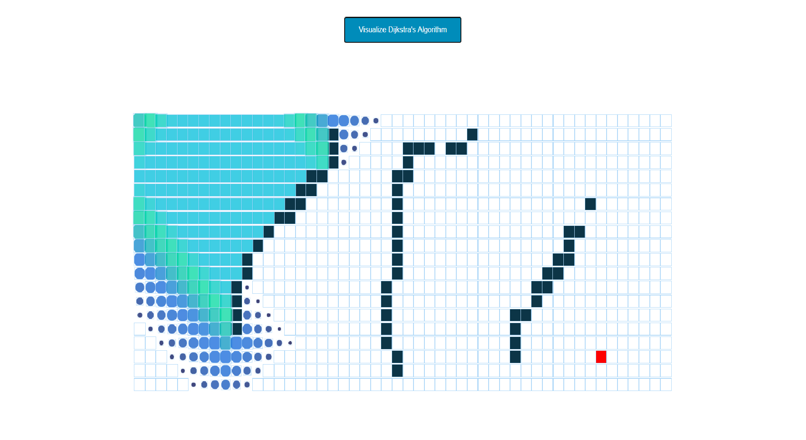

# Dijkstra Pathfinder Visualizer

## Motivation and Summary:
The distance between two entities, whether they are geometrically represented points or physical structures, becomes the focal point, when there exists more than one way to reach that destination. In such cases, it is usually self-evident that the shortest path between the source and the destination points is the most traveled route. Such a concept is vividly-observed in day-to-day scenarios, such as using the maps to find the shortest path or minimum cost of gas to get from one point to another. Thus, the introduction of such an algorithm that computes the shortest distance between the two points in the most optimal way becomes a necessity. In this project, we are focussing on the visualization of one of those algorithms, Dijkstra's Algorithm. It is an algorithm we can use to find the shortest distances or minimum costs depending on what is represented, in a graph. This project contains the implementation of the above-mentioned Dijkstra's algorithm using concepts of Reactjs, HTML, and CSS, Node.js, and JavaScript. This project extensively uses the pathfinding algorithm and ReactApp to produce the desired visualization of the algorithm.

# Concepts Used:
- Algorithms
  - Pathfinding Algorithms
  - Dijikstra’s Shortest Path Algorithm
- Technologies
  - React Framework
  - Node.Js
  - HyperText Markup Markup Language (HTML) & CSS
  - JavaScript

## Thanks To:
Clément Mihailescu : https://github.com/clementmihailescu
